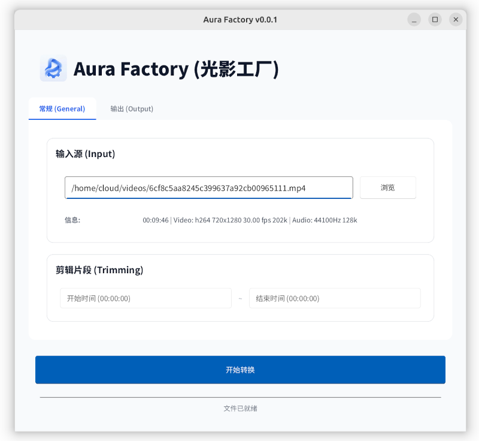
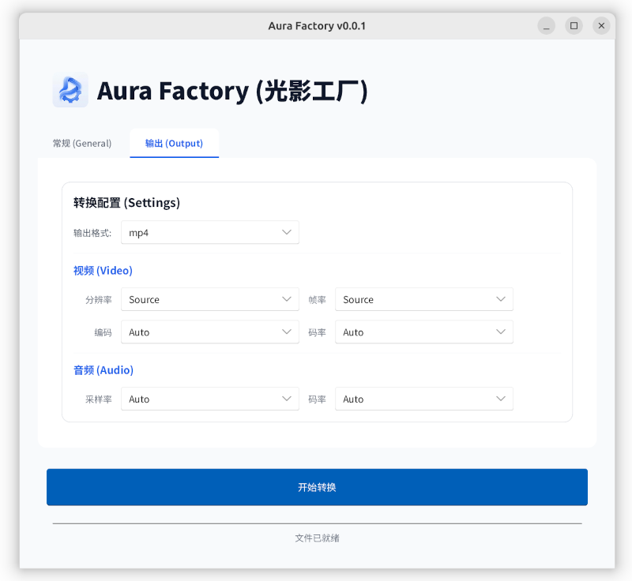

# aura-factory
Aura Factoryは、Rustで開発された、無料かつオープンソースのデスクトップオーディオ・ビデオ変換ツールです。ユーザーインターフェースの構築には最新のGUIフレームワークであるSlintを使用し、基盤となるオーディオ・ビデオ処理エンジンにはFFmpegを使用しています。

Aura Factoryは、高性能なシステムプログラミング言語と最新のGUIフレームワークを組み合わせ、最新のRustデスクトップアプリケーション開発に必要な包括的なテクノロジースタックを提供しています。

このプロジェクトは、合理的なアーキテクチャ設計を採用しており、優れた保守性と拡張性を備えています。詳細なコード分析とモジュール設計により、将来の機能拡張のための強固な基盤が築かれています。

---
[English](./README.md) | [中文](./README_cn.md) | 日本語

## 1. ソフトウェアスタック
- https://rust-lang.org
- https://slint.dev
- https://crates.io/crates/ffmpeg-sidecar

## 2. デバッグ
```
cargo run .
```

## 3. ビルド
### 3.1 Windows
```powershell

./build.ps1
 
```

### 3.2 Linux
```bash
./build.sh
 
```

## 4. インストールとアンインストール
- 4.1 Windows
  - [リリースページ](https://github.com/owu/aura-factory/releases) から最新リリースをダウンロードします。
  - 任意のディレクトリに zip ファイルを解凍します。
  - `AuraFactory.v0.0.2.x86_64-windows.exe` を実行します。

- 4.2 Linux インストール
  - [リリースページ](https://github.com/owu/aura-factory/releases) から最新リリースをダウンロードします。
```
mkdir ./AuraFactory.x86_64-linux  &&  tar  -xJf   ./AuraFactory.v0.0.2.x86_64-linux.tar.xz  -C  ./AuraFactory.x86_64-linux  &&  cd  ./AuraFactory.x86_64-linux  && sudo  make  install
```
- 4.3 Linux アンインストール
```
cd  ./AuraFactory.x86_64-linux  &&  sudo make  uninstall && cd ../ &&  rm -rf  ./AuraFactory.x86_64-linux
```


## 5. スクリーンショット
<p align="center">
  
  
</p>